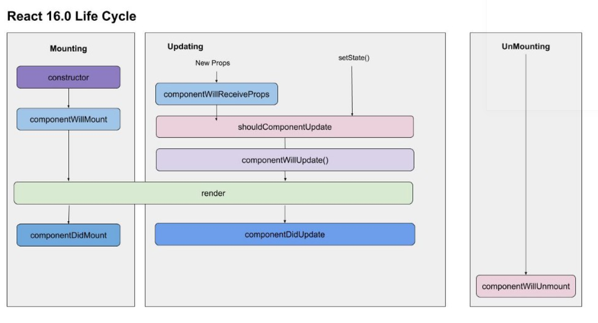

## 8. React

### 8.1 Базовый React

### 8.1.1 Зачем вообще нужен React ?

<details>
<summary>Ответ</summary>

Сегодня очень большим количеством сервисов пользуются через браузер.  
Интерфейс современных приложений должен быть более умным и отзывчивым (динамически менятся в зависимости от действий пользователя).  
Чтобы сделать это в браузере, нужно напрямую менять DOM.  
Основные причины почему это не ок:

- Менять DOM напрямую медленно (reflow, repainting);
- Когда мы меняем DOM чистым JSом, это императивный подход, и с ним сложнее работать чем с декларативным;

```jsx
// imperative approach
const button = document.createElement("button");
button.textContent = "Greeting button";
button.addEventListener("click", () => "hello");

// declarative approach
<button onClick={() => "hello"}>Greeting button</button>;
```

React решает эти проблемы:

- React использует декларативный подход (который на этапе сборки транспилируется в императивный);
- Под капотом React минимизует обращения к DOM (Virtual DOM);
</details>

### 8.1.2 Почему React и ReactDOM в разных модулях ?

<details>
<summary>Ответ</summary>

В модуле `react` находится код для создания React-элементов (`React.createElement`).  
Через `react-dom` можно рендерить эти React-элементы в реальный DOM.

Причина разделения в том, что React-элементы созданные `react` можно рендерить не только в DOM браузера (`react-native`, `electron`).

</details>

### 8.1.3 Что такое Virtual DOM и как он работает ?

<details>
<summary>Ответ</summary>

Грубо говоря, Virtual DOM это обычный JS-объект.  
Перестраивать этот объект гораздо быстрее, чем перерендеривать реальный DOM.  
Поэтому когда нужно перерисовать интерфейс, React применяет **все изменения** к Virtual DOM и только **финальный результат** применяет к реальному DOM.  
То есть мехпнизм Virtual DOM минимизирует количество обращений к реальному DOM.  
Кроме того, React по-максимуму старается минимизировать количество перерисовок (например, если у ноды DOM поменялся атрибут, React не будет перисовывать его, а просто перезапишет атрибут)

[Как React работает под капотом](https://www.freecodecamp.org/news/react-under-the-hood/).

</details>

### 8.1.4 Что такое reconciliation и как оно работает ?

<details>
<summary>Ответ</summary>

Реконсиляция (согласование) - механизм сравнения старого и нового Virtual DOM и применения минимальных изменений к реальному DOM.


Virtual DOM и реальный DOM - два дерева.  
Нужно найти разницу между ними.  
Передовые алгоритмы имеют сложность порядка O(n^3), где n - количество элементов в деревьях (слишком медленно).  
Чтобы ускорить алгоритм сравнения деревьев используются две эвристики:

- Два элемента с разными типами произведут разные деревья (то есть если React видит, что `div` поменялся на `article`, он дальше не проверяет, что увеличивает скорость сравнения).
- Разработчик может указать, какие дочерние элементы могут оставаться стабильными между разными рендерами с помощью пропа `key`.

</details>

### 8.1.5 Зачем нужен атрибут `key` ?

<details>
<summary>Ответ</summary>

```html
<!-- изначально есть список -->
<ul>
  <li>1</li>
  <li>2</li>
  <li>3</li>
</ul>

<!-- что-то поменялось и список перерисовался -->
<ul>
  <li>4</li>
  <li>1</li>
  <li>2</li>
  <li>3</li>
</ul>
```

React сравнивает первый элемент первоначально списка с первым элементом получившегося списка, второй со вторым и т.д.  
При каждом сравнении есть несовпадение.  
Реакт полностью перерисовывает список, хотя можно было бы просто добавить новую ноду в начало списка.

Тут помогают key:

```html
<!-- изначально есть список -->
<ul>
  <li key="67f823f42f2">1</li>
  <li key="12d321as211">2</li>
  <li key="jk2131434f1">3</li>
</ul>

<!-- что-то поменялось и список перерисовался -->
<ul>
  <li key="new-key-aye">4</li>
  <li key="67f823f42f2">1</li>
  <li key="12d321as211">2</li>
  <li key="jk2131434f1">3</li>
</ul>
```

В этом случае React сравнивает не первый с первым, а по ключам, и в результате понимает, что в новом списке просто добавилась нода сверху.

Для ключей лучше использовать id элементов, которые мы отрисовываем.  
Для ключей не имеет смысла генерировать новое значение на каждом рендере (`<li key={createHash()}></li>`) или использовать что-то типа `Date.now()` или `Math.rand()`

</details>

### 8.1.6 Когда можно использовать index для key ?

<details>
<summary>Ответ</summary>

Если точно известно, что порядок элементов не будет меняться.  
Например для `options` в `select`.

</details>

### 8.1.7 Опиши жизненный цикл React-компонента

<details>
<summary>Ответ</summary>

Старый жизненный цикл:


Новый жизненный цикл:


Есть еще два ЖЦ-метода:

- `static getDerivedStateFromError` - используем для рендеринга запасного UI;
- `componentDidCatch` - используем для логирования ошибок;

Если компонент имплементирует один из этих методов, то он является `Error boundary`.

</details>

### 8.1.8 Где делать сайд-эффекты (запросы за данными / читать из localStorage) ?

<details>
<summary>Ответ</summary>

В `componentDidMount` (классовый компонент) или в `useEffect` (хуки).

</details>

### 8.1.9 Что такое `Error boundary` ?

<details>
<summary>Ответ</summary>

```jsx
import React from "react";

class ErrorBoundary extends React.Component {
  constructor(props) {
    super(props);

    this.state = { hasError: false };
  }

  static getDerivedStateFromError(error) {
    // Обновить состояние с тем, чтобы следующий рендер показал запасной UI.
    return { hasError: true };
  }

  componentDidCatch(error, errorInfo) {
    // Можно также сохранить информацию об ошибке в соответствующую службу журнала ошибок
    logErrorToMyService(error, errorInfo);
  }

  render() {
    if (this.state.hasError) {
      // Можно отрендерить запасной UI произвольного вида
      return <h1>Что-то пошло не так.</h1>;
    }

    return this.props.children;
  }
}
```

`ErrorBoundary` оборачивает компонеты.  
`ErrorBoundary` ловит исключения, которые выбрасывают его дочерние компоненты.

</details>

### 8.1.10 Что такое `React.lazy` ?

<details>
<summary>Ответ</summary>

Webpack собирает все .js, .jsx в один файл - бандл.  
Если этих файлов слишком много / они большие, бандл тоже получится большой.  
Если бандл будет большим, index.html будет долго его загружать.  
В таких ситуациях можно разбить один большой бандл на несколько кусков поменьше и загружать только нужные куски.  
Для этого используются динамические импорт:

```js
function getComponent() {
  const element = document.createElement("div");

  return import("lodash") // import() возвращает промис
    .then(({ default: _ }) => {
      const element = document.createElement("div");
      element.innerHTML = _.join(["Hello", "webpack"], " ");
      return element;
    })
    .catch((error) => "An error occurred while loading the component");
}

getComponent().then((component) => {
  document.body.appendChild(component);
});
```

Ну а в React можно динамически подгружать компоненты (но немного другой синтаксис):

```jsx
import React from "react";

// React.lazy используется именно для динамической подгрузки компонентов
const SomeComponent = React.lazy(() => import("@components/some-component"));

function App() {
  return (
    <React.Suspense fallback={<p>Loading...</p>}>
      <SomeComponent />
    </React.Suspense>
  );
}
```

Динамически подгружаемые компоненты нужно оборачивать в `<React.Suspense>`.  
Пока `<SomeComponent />` не загрузится, будет показано то, что в `fallback`.

</details>

### 8.1.11 Почему `componentWillMount`, `componentWillReceiveProps`и`componentWillUpdate` убрали из React ?

<details>
<summary>Ответ</summary>

Во-первых, эти методы часто неправильно использовали (делали асинхронные запросы в `componentWillMount`, записывали пропсы в стейт в `componentWillReceiveProps` и т.д).

Во-вторых, сейчас команда React работают над асинхронным рендерингом и конкурентным режимом.

```jsx
import React from "react";

const resource = fetchProfileData();

function ProfileDetails() {
  // Пробуем прочитать информацию о пользователе, хотя она может быть ещё не загружена
  const user = resource.user.read();
  return <h1>{user.name}</h1>;
}

function ProfileTimeline() {
  // Пробуем прочитать сообщения, хотя они могут быть ещё не загружены
  const posts = resource.posts.read();
  return (
    <ul>
      {posts.map((post) => (
        <li key={post.id}>{post.text}</li>
      ))}
    </ul>
  );
}

function ProfilePage() {
  return (
    <Suspense fallback={<h1>Loading profile...</h1>}>
      <ProfileDetails />
      <Suspense fallback={<h1>Loading posts...</h1>}>
        <ProfileTimeline />
      </Suspense>
    </Suspense>
  );
}
```

Несмотря на то, что для компонентов `ProfileTimeline` и `ProfileTimeline` еще не пришли данные и их нельзя рендерить, у них вызываются методы ЖЦ, которые можно вызывать (`constructor`, `componentWillMount` и т.д.).  
Например мы делаем `setInterval` в `componentWillMount` компонента `ProfileTimeline`.  
Предположим, что было выброшено исключение при загрузке данных (`resource.posts.read()`).  
Тогда нас выбросит в ближайший `ErrorBoundary` для `ProfileTimeline` (если `ErrorBoundary` есть).  
Но самое главное, что `setInterval` из `componentWillMount` компонента `ProfileTimeline` никуда не пропадет и **будет утечка памяти**.  
То есть можно сказать, что **прерывающая обработка ошибок в React может привести к утечкам памяти**.  
Это одна из причин депрекейта методов `componentWillMount`, `componentWillReceiveProps` и `componentWillUpdate`.

</details>

### 8.1.12 Расскажи про `shouldComponenUpdate`

<details>
<summary>Ответ</summary>

```jsx
import React from "react";

class SomeComponent extends React.Component {
  /**
   *
   * @param {object} nextProps - пропсы перед обновлением компонента
   * @param {object} nextState - стейт перед обновлением компонента
   * @returns {boolean} - нужно ли обновлять компонент
   *
   **/
  shouldComponentUpdate(nextProps, nextState) {}
}
```

</details>

### 8.1.13 Что такое `PureComponent` ?

<details>
<summary>Ответ</summary>

Это компонент с переопределенным методом `shouldComponenUpdate`: выполняет shallow comparsion пропсов и стейта и возвращает результат логического типа.

</details>

### 8.1.14 В чем разница между `props` и `state` ?

<details>
<summary>Ответ</summary>

- `props` приходят в компонент извне, а `state` - это внутреннее состояние компонета;
- `props` нельзя менять, а `state` можно;

</details>

### 8.1.15 Как поменять `state` ?

<details>
<summary>Ответ</summary>

Только через `this.setState` (классовый компонент) или через сеттер (хуки).

</details>

### 8.1.16 Что такое `PropTypes` ?

<details>
<summary>Ответ</summary>

`PropTypes` - модуль для описания типов пропсов.

```jsx
import React from "react";
import PropTypes from "prop-types";

function SomeComponent(props) {
  // ...
}

SomeComponent.propTypes = {
  isActive: PropTypes.bool.isRequired,
};
```

или

```jsx
import React from "react";
import PropTypes from "prop-types";

class SomeComponent extends React.Component {
  // ...

  static propTypes = {
    isActive: PropTypes.bool.isRequired,
  };

  // ...
}
```

- при несовпадении пропсов падает ошибка (даже во время выполнения приложения);
- не работают в production сборке (перфоманс);

</details>

### 8.1.17 Что такое `defaultProps` ?

<details>
<summary>Ответ</summary>

`defaultProps` - дефолтные значения пропсов.

```jsx
import React from "react";

function SomeComponent(props) {
  // ...
}

SomeComponent.defaultProps = {
  isActive: false,
};
```

или

```jsx
import React from "react";

class SomeComponent extends React.Component {
  // ...

  static defaultProps = {
    isActive: false,
  };

  // ...
}
```

</details>

### 8.1.18 `PropTypes` vs `TypeScript` ?

<details>
<summary>Ответ</summary>

`TypeScript` на этапе сборки компилируется в обычный JavaScript без типов.  
Код с `PropTypes` на этапе сборки компилируется в JavaScript, **причем конструкции проверки типов сохраняются**.  
Это значит, что `PropTypes` работает и во время выполнения приложения, а `TypeScript` только при статическом анализе кода.

</details>

### 8.1.19 Что такое HOC ?

<details>
<summary>Ответ</summary>

HOC - high order component. Обертка вокруг изначального компонента.  
Используется для реиспользования логики.  
По конвенции нейминга, имя должно начинаться с _with_.

Пример HOC:

```jsx
import React from "react";

export default (BaseComponent) =>
  class extends React.Component {
    rootNode = React.createRef();

    componentDidMount() {
      if (this.props.closeOnOutsideClick) {
        document.addEventListener("click", this.handleOutsideClick);
      }
    }

    componentWillUnmount() {
      if (this.props.closeOnOutsideClick) {
        document.removeEventListener("click", this.handleOutsideClick);
      }
    }

    handleOutsideClick = (event) => {
      if (this.rootNode && !this.rootNode.current.contains(event.target)) {
        this.props.onOutsideClick(false);
      }
    };

    render() {
      return <BaseComponent {...this.props} ref={this.rootNode} />;
    }
  };
```

Еще функция `connect` из `react-redux` _возвращает_ HOC.

</details>

### 8.1.20 React portal ?

<details>
<summary>Ответ</summary>

[React portal](https://ru.reactjs.org/docs/portals.html).

</details>

### 8.1.21 `SyntheticEvent` ?

<details>
<summary>Ответ</summary>

[SyntheticEvent](https://ru.reactjs.org/docs/events.html).

</details>

### 8.1.22 `Context` ?

<details>
<summary>Ответ</summary>

[Контекст](https://ru.reactjs.org/docs/context.html).

</details>

### 8.1.23 `Context` vs `useReducer` vs `Redux` ?

<details>
<summary>Ответ</summary>

**В принципе `Context` vs `useReducer` vs `Redux` решают одну задачу, но нельзя сказать, что они заменяют друг друга.**

У `Redux` большое сообщество: много доков, вопросов на StackOverflow. В отличие от `Context` и `useReducer` в `Redux` есть middleware для сайд эффектов и DevTools для браузера.  
Но dispatch даже одного action приводит к тому, что вызываются все reducers, поэтому не нужно прямо все данные приложения класть в `Redux`.

Если компонент использует несколько `useState` (больше трех), то тут отлично подойдет `useReducer`.  
Хоть `useReducer` и похож на reducer `Redux`, `useReducer` будет плохой заменой `Redux` на проекте, т.к. как минимум `useReducer` не поддерживает middleware и DevTools.

`Context` можно использовать в случае, если глобальный стор нужно использовать только для чего-то одного (тема приложения, язык и т.д.).  
То есть решить задачу встроенными возможностями `React`, не импортируя `Redux` (уменьшаем бандл).  
Но вообще `Context` лучше использовать не сильно много на странице (один-два раза).

</details>

---

## 8.2 Хуки

### 8.2.1 Зачем вообще нужны хуки ?

<details>
<summary>Ответ</summary>

Аргументы в пользу хуков:

- HOCи слишком абстрактные, с ними тяжело работать;
- HOCи приводят к "HOC hell";
- Virtual DOM засоряется хоками. Увеличение комопнентов -> уменьшение скорости согласования;
- Нельзя использовать стейт в функциональных компонентах, а в классовых нужно постоянно думать о `bind`;
- Неудобно использовать `Context`;
- Хуки декларативные;

</details>

### 8.2.2 `useState` ?

<details>
<summary>Ответ</summary>

[`useState`](https://ru.reactjs.org/docs/hooks-reference.html#usestate).

[В сеттер можно передать коллбэк, который принимает предыдущий стейт](https://ru.reactjs.org/docs/hooks-reference.html#functional-updates).

</details>

### 8.2.3 Когда в `useState` нужно передавать коллбэк ?

<details>
<summary>Ответ</summary>

[Ленивая инициализация](https://ru.reactjs.org/docs/hooks-reference.html#lazy-initial-state).

```jsx
import React from "react";

function difficultComputation(isActive) {
  // slow sync function
}

function App() {
  // при каждом ререндере будет вызываться difficultComputation
  const [state, setState] = React.useState(difficultComputation());

  // ...
}
```

Если в `useState` передать коллбэк, он вызовется только при первом рендеринге.

```jsx
import React from "react";

function difficultComputation(isActive) {
  // slow sync function
}

function App() {
  // difficultComputation вызовется только при первом рендеринге
  const [state, setState] = React.useState(() => difficultComputation());

  // ...
}
```

</details>

### 8.2.4 `useEffect` ?

<details>
<summary>Ответ</summary>

[`useEffect`](https://ru.reactjs.org/docs/hooks-reference.html#useeffect).

Сторонние эффекты и рендеринг должны быть независимы (интерфейс не должен _ломаться_, если запрос за данными вернул ошибку).  
Поэтому сторонние эффекты выносят в `useEffect`.

`useEffect` === `componentDidMount` + `componentDidUpdate` + `componentWillUnmount`.

</details>

### 8.2.5 `useEffectLayout` ?

<details>
<summary>Ответ</summary>

[`useEffectLayout`](https://ru.reactjs.org/docs/hooks-reference.html#uselayouteffect).

Вызывается после того, как компонент врендерился в DOM и его размеры посчитались.  
Используется в основном для работы с элементами DOM.

</details>

### 8.2.6 `useReducer` ?

<details>
<summary>Ответ</summary>

[`useReducer`](https://ru.reactjs.org/docs/hooks-reference.html#usereducer).

Если компонент использует несколько `useState` (больше трех), то тут отлично подойдет `useReducer`.

</details>

### 8.2.6 `useReducer` vs `Redux` ?

<details>
<summary>Ответ</summary>

Хотя `useReducer` и похож на reducer `Redux`, `useReducer` будет плохой заменой `Redux` на проекте, т.к. как минимум `useReducer` не поддерживает middleware и DevTools.

Можно вынести сайд эффекты в `useEffect`, и использовать `useEffect` в качестве middleware, но это все же не то.  
Для работы с данными (хранение, запросы за данными, нетривиальные изменения данных) лучше подойдет `Redux`.

</details>

### 8.2.8 `useRef` ?

<details>
<summary>Ответ</summary>

[`useRef`](https://ru.reactjs.org/docs/hooks-reference.html#useref).

Можно использовать для:

- хранения ссылки на uncontrolled элемент;
- хранения значения, изменение которого не должно вызывать ререндеринг (супер редко);

</details>

### 8.2.9 `useContext` ?

<details>
<summary>Ответ</summary>

[`useContext`](https://ru.reactjs.org/docs/hooks-reference.html#usecontext).

</details>

### 8.2.10 `useCallback` ?

<details>
<summary>Ответ</summary>

[`useCallback`](https://ru.reactjs.org/docs/hooks-reference.html#usecallback).

</details>

### 8.2.11 Когда использовать `useCallback` ?

<details>
<summary>Ответ</summary>

**Не всегда.**

Ситуцация, когда все-таки нужно использовать `useCallback`:

```jsx
import React from "react";

import axios from "axios";

function ChildWithComplexEffect(props) {
  const { fetchData } = props;

  const [data, setData] = React.useState(null);

  // каждый раз, когда меняется проп fetchData, вызывается эффект на подтягивание данных
  React.useEffect(() => {
    fetchData().then((fetchedData) => {
      setData(fetchedData);
    });
  }, [fetchData]);

  return <h1>{data ? JSON.stringify(data) : data}</h1>;
}

function App() {
  const [toggler, setToggler] = React.useState(false);

  // Каждый раз при редрере (вызове App) функция fetchData объявляется заново
  // Каждый раз при редрере (вызове App) функция fetchData заново создается в памяти
  // Каждый раз при редрере (вызове App) функция ссылка на fetchData меняется
  // Каждый раз при редрере (вызове App) в <ChildWithComplexEffect /> как бы передается другой проп (другая ссылка на fetchData, хотя сама функция делает то же самое)
  // Каждый раз при редрере (вызове App) в <ChildWithComplexEffect /> вызывается эффект (так как он зависит от пропа fetchData)
  function fetchData() {
    return axios("https://api.kanye.rest?format=text").then(({ data }) => data);
  }

  return (
    <>
      <h1>{toggler}</h1>
      {/* Каждый раз когда жму на кнопку Toggle, компонент ререндерится (вызывается App) */}
      <button onClick={() => setToggler(!toggler)}>Toggle</button>
      {/* Каждый раз при ререндере ссылка на fetchData меняется и <ChildWithComplexEffect /> ререндерится (хотя ему не надо) */}
      <ChildWithComplexEffect fetchData={fetchData} />
    </>
  );
}
```

Решение:

```jsx
import React from "react";

import axios from "axios";

function ChildWithComplexEffect(props) {
  const { fetchData } = props;

  const [data, setData] = React.useState(null);

  // каждый раз, когда меняется проп fetchData, вызывается эффект на подтягивание данных
  React.useEffect(() => {
    fetchData().then((fetchedData) => {
      setData(fetchedData);
    });
  }, [fetchData]);

  return <h1>{data ? JSON.stringify(data) : data}</h1>;
}

function App() {
  const [toggler, setToggler] = React.useState(false);

  // Теперь ссылка на fetchData будет одинакова между ререндерами
  const fetchData = React.useCallback(
    () => axios("https://api.kanye.rest?format=text").then(({ data }) => data),
    []
  );

  return (
    <>
      <h1>{toggler}</h1>
      {/* Каждый раз когда жму на кнопку Toggle, компонент ререндерится (вызывается App) */}
      <button onClick={() => setToggler(!toggler)}>Toggle</button>
      {/* Каждый раз при ререндере ссылка на fetchData такая же */}
      {/* Ререндер не происходит */}
      <ChildWithComplexEffect fetchData={fetchData} />
    </>
  );
}
```

Но нужно помнить, что **оптимизация всегда имеет цену**.  
Используя `useCallback` мы нагрузили React работой хранить в памяти между рендерами функцию.  
Не нужно нагружать React работой без явной причины, это может сказаться на перфомансе.

**Причина использовать `useCallback` - тяжелый эффект в дочернем компоненте, который лучше не вызывать без причины.**  
В остальных случаях `useCallback` лучше не использовать.
Даже если передача ссылки на функцию вызывает рендер, это не сильно повлияет на перфоманс, так как React умный (выполняет сверку и не рендерит в DOM просто так).

</details>

### 8.2.12 `useMemo` ?

<details>
<summary>Ответ</summary>

[`useMemo`](https://ru.reactjs.org/docs/hooks-reference.html#usememo).

</details>

---

## 8.3 `React Router`

### 8.3.1 Что такое `React Router` ?

<details>
<summary>Ответ</summary>

Модуль для рендеринга компонентов в зависимости от урла.

</details>

### 8.3.2 Какие основные компоненты есть у `React Router` ?

<details>
<summary>Ответ</summary>

Роутеры:

- `<BrowserRouter />`;
- `<HashRouter />`;
- ..

Матчеры:

- `<Switch />`;
- `<Route />`;
- `<Redirect />`;

Ссылки:

- `<Link />`;
- `<NavLink />`;

[Тут подробнее](https://reactrouter.com/web/guides/primary-components).

</details>

### 8.3.3 `<Link />` vs `<NavLink />` ?

<details>
<summary>Ответ</summary>

`<NavLink />` - это тот же `<Link />`, только с атрибутами `activeClassName` и `activeStyle`.  
`activeClassName` применяет класс к ссылке на активный роут.  
`activeStyle` применяет стиль к ссылке на активный роут.

Как и в случае с `<Route />` выполняется частичное сравнение, поэтому _иногда_ нужно использовать атрибут `exact`.

```jsx
const Router = () => (
  <BrowserRouter>
    <div>
      <Nav>
        {/* Саб-роут "/" есть в каждом роуте, */}
        {/* поэтому для настоящего "/" нужно использовать exact */}
        <NavLink activeClassName="is-active" to="/" exact>
          Home
        </NavLink>
        <NavLink activeClassName="is-active" to="/about">
          About
        </NavLink>
      </Nav>

      <Match pattern="/" exactly component={Home} />
      <Match pattern="/about" exactly component={About} />
      <Miss component={NoMatch} />
    </div>
  </BrowserRouter>
);
```

</details>

### 8.3.4 Как программно можно влиять на роут ?

<details>
<summary>Ответ</summary>

[Способы программно влиять на роут](https://stackoverflow.com/a/42121109).

</details>

### 8.3.5 Что такое `withRouter` ?

<details>
<summary>Ответ</summary>

[withRouter](https://reactrouter.com/web/api/withRouter).

</details>

### 8.3.6 Какие хуки есть у `React Router` ?

<details>
<summary>Ответ</summary>

[Хуки React Router](https://css-tricks.com/the-hooks-of-react-router/).

</details>
